# 06 — Stack Empresarial con Docker Compose y Portainer


Despliegue de una infraestructura web completa con Docker y Docker Compose sobre Ubuntu Server 22.04. El stack incluye un servidor web con imagen propia construida desde un Dockerfile, una base de datos MariaDB con persistencia mediante volúmenes, phpMyAdmin para gestión de la base de datos y Portainer como interfaz visual de administración de Docker.

---

## Índice

- [Conceptos clave](#conceptos-clave)
- [Arquitectura del stack](#arquitectura-del-stack)
- [Instalación de Docker](#instalación-de-docker)
- [Estructura del proyecto](#estructura-del-proyecto)
- [Despliegue](#despliegue)
- [Verificación](#verificación)
- [Persistencia de datos](#persistencia-de-datos)
- [Problemas encontrados](#problemas-encontrados)

---

## Conceptos clave

| Concepto | Descripción |
|---|---|
| Imagen | Plantilla de solo lectura que define el contenido de un contenedor |
| Contenedor | Una imagen en ejecución, aislada pero compartiendo el kernel del host |
| Dockerfile | Archivo de instrucciones para construir una imagen personalizada |
| Volumen | Almacenamiento que persiste fuera del ciclo de vida del contenedor |
| Red Docker | Permite que los contenedores se resuelvan entre sí por nombre (DNS interno) |
| Docker Compose | Orquesta múltiples contenedores definidos en un único archivo YAML |

A diferencia de una máquina virtual, un contenedor no incluye un sistema operativo completo ni un kernel propio: comparte el kernel de Linux del host, lo que lo hace mucho más ligero (cientos de MB frente a decenas de GB) y rápido de arrancar (segundos frente a minutos).

---

## Arquitectura del stack

```
SRV-DOCKER (Ubuntu Server 22.04)
Docker Engine + Docker Compose
        │
        └── red-empresa (red Docker personalizada)
            │
            ├── db-empresa          (mariadb:latest)
            │   └── volumen: datos-empresa → /var/lib/mysql
            │
            ├── phpmyadmin-empresa  (phpmyadmin:latest)
            │   └── conecta a db-empresa por nombre (PMA_HOST)
            │   └── puerto 8092:80
            │
            ├── web-empresa         (imagen propia: empresa-stack-web)
            │   └── construida desde ./web/Dockerfile
            │   └── puerto 8090:80
            │
            └── portainer-empresa   (portainer/portainer-ce:latest)
                └── volumen: datos-portainer → /data
                └── acceso a /var/run/docker.sock
                └── puerto 9443:9443 (HTTPS)
```

---

## Instalación de Docker

### Repositorio oficial e instalación

```bash
sudo apt install -y ca-certificates curl gnupg
sudo install -m 0755 -d /etc/apt/keyrings
curl -fsSL https://download.docker.com/linux/ubuntu/gpg | sudo gpg --dearmor -o /etc/apt/keyrings/docker.gpg
sudo chmod a+r /etc/apt/keyrings/docker.gpg

echo \
  "deb [arch=$(dpkg --print-architecture) signed-by=/etc/apt/keyrings/docker.gpg] https://download.docker.com/linux/ubuntu \
  $(. /etc/os-release && echo "$VERSION_CODENAME") stable" | \
  sudo tee /etc/apt/sources.list.d/docker.list > /dev/null

sudo apt update
sudo apt install -y docker-ce docker-ce-cli containerd.io docker-buildx-plugin docker-compose-plugin
```

### Verificación con imagen de prueba

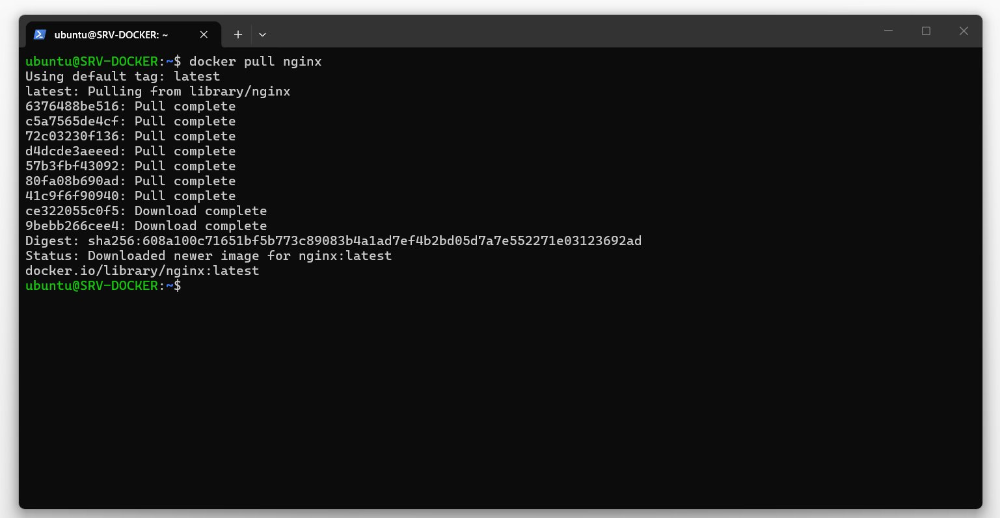

### Permisos de usuario (evitar usar sudo en cada comando)

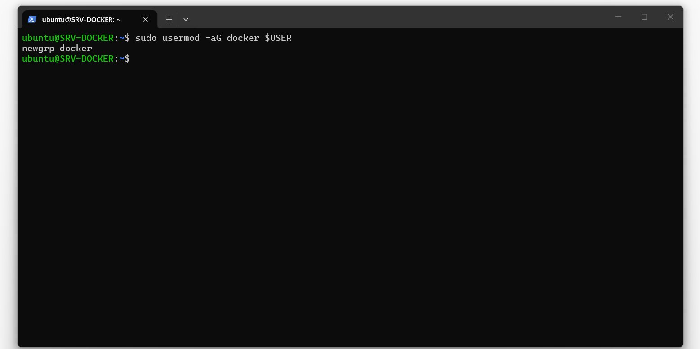

```bash
sudo usermod -aG docker $USER
newgrp docker
```

---

## Estructura del proyecto

```
empresa-stack/
├── docker-compose.yml
├── .env
└── web/
    ├── Dockerfile
    └── html/
        └── index.html
```

### Variables de entorno (.env)

Las credenciales se separan del `docker-compose.yml` como buena práctica — el `.env` no se sube al repositorio:

```env
MYSQL_ROOT_PASSWORD=admin
MYSQL_DATABASE=empresa_multisede
MYSQL_USER=user
MYSQL_PASSWORD=user
```

> En un entorno de producción real estas credenciales serían más robustas y se gestionarían con un sistema de secretos (Vault, AWS Secrets Manager, etc).

### Dockerfile del servidor web

```dockerfile
FROM nginx:alpine

LABEL maintainer="Daniel Loyo"
LABEL description="Servidor web de la empresa multisede"

COPY html/ /usr/share/nginx/html/

EXPOSE 80

CMD ["nginx", "-g", "daemon off;"]
```

### docker-compose.yml

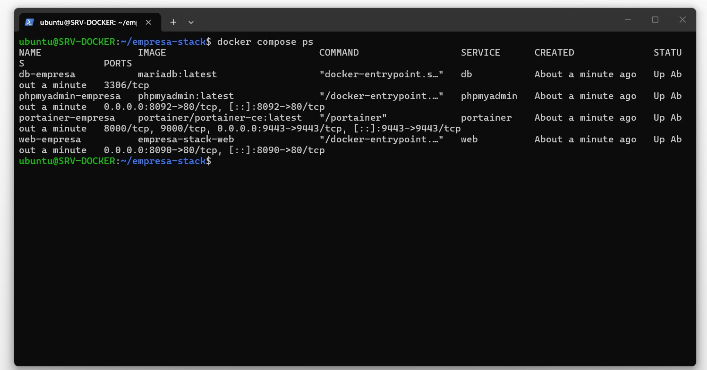
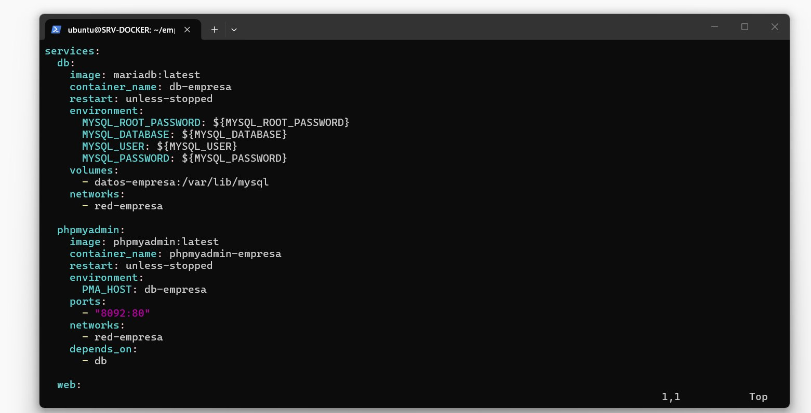

```yaml
services:
  db:
    image: mariadb:latest
    container_name: db-empresa
    restart: unless-stopped
    environment:
      MYSQL_ROOT_PASSWORD: ${MYSQL_ROOT_PASSWORD}
      MYSQL_DATABASE: ${MYSQL_DATABASE}
      MYSQL_USER: ${MYSQL_USER}
      MYSQL_PASSWORD: ${MYSQL_PASSWORD}
    volumes:
      - datos-empresa:/var/lib/mysql
    networks:
      - red-empresa

  phpmyadmin:
    image: phpmyadmin:latest
    container_name: phpmyadmin-empresa
    restart: unless-stopped
    environment:
      PMA_HOST: db-empresa
    ports:
      - "8092:80"
    networks:
      - red-empresa
    depends_on:
      - db

  web:
    build: ./web
    container_name: web-empresa
    restart: unless-stopped
    ports:
      - "8090:80"
    networks:
      - red-empresa

  portainer:
    image: portainer/portainer-ce:latest
    container_name: portainer-empresa
    restart: unless-stopped
    ports:
      - "9443:9443"
    volumes:
      - /var/run/docker.sock:/var/run/docker.sock
      - datos-portainer:/data
    networks:
      - red-empresa

volumes:
  datos-empresa:
  datos-portainer:

networks:
  red-empresa:
```

---

## Despliegue

### Levantar todo el stack con un solo comando

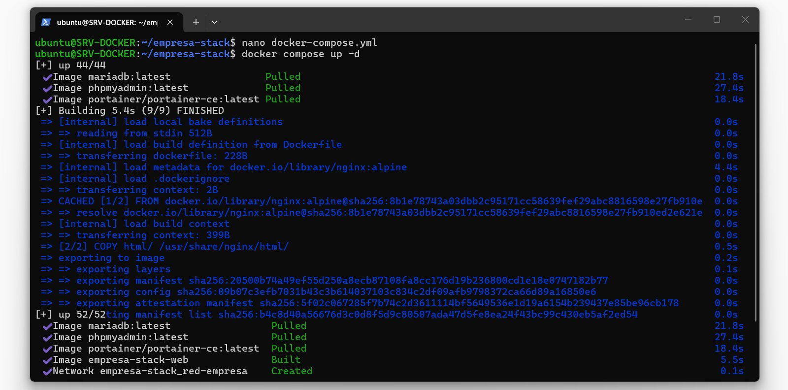

```bash
docker compose up -d
```

Docker Compose descarga las imágenes oficiales (`mariadb`, `phpmyadmin`, `portainer-ce`), construye la imagen propia `empresa-stack-web` desde el Dockerfile, crea la red `red-empresa` y los volúmenes, y levanta los 4 contenedores conectados entre sí.

### Imágenes resultantes

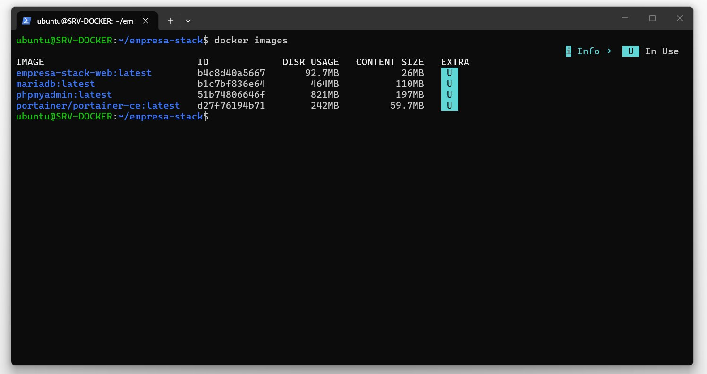

```
REPOSITORY                  TAG       SIZE
empresa-stack-web           latest    92.7MB
mariadb                     latest    464MB
phpmyadmin                  latest    821MB
portainer/portainer-ce      latest    242MB
```

---

## Verificación

### Servidor web personalizado

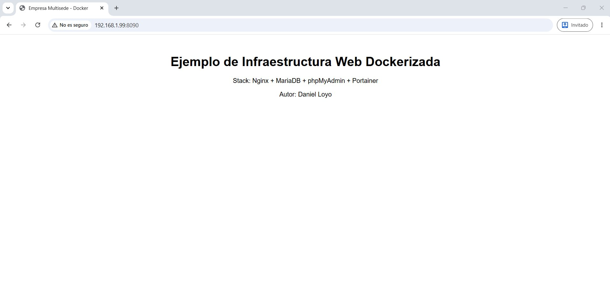

```
http://IP-SRV-DOCKER:8090
```

### phpMyAdmin — Login

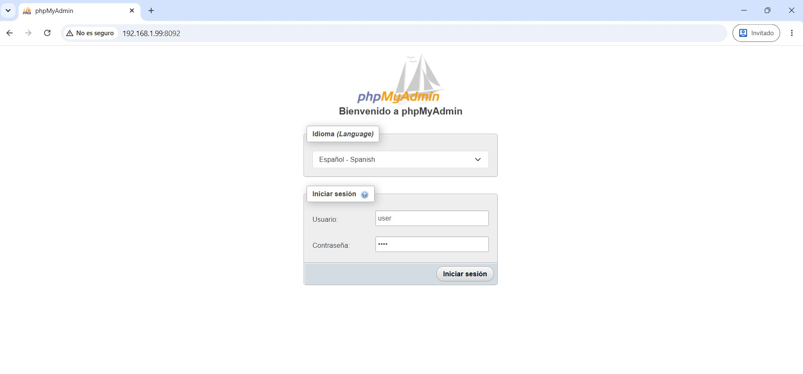

```
http://IP-SRV-DOCKER:8092
Servidor: db-empresa
Usuario:  user
```

### phpMyAdmin — Tabla de prueba

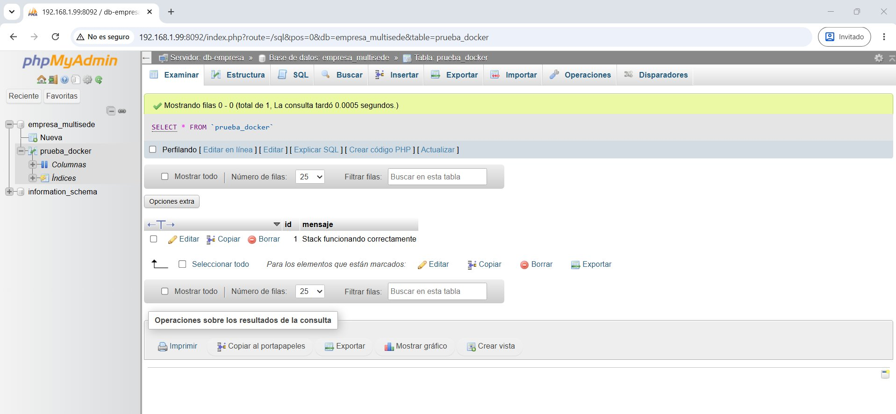

```sql
CREATE TABLE prueba_docker (
    id INT AUTO_INCREMENT PRIMARY KEY,
    mensaje VARCHAR(100)
);

INSERT INTO prueba_docker (mensaje) VALUES ('Stack funcionando correctamente');
```

### Portainer — Dashboard

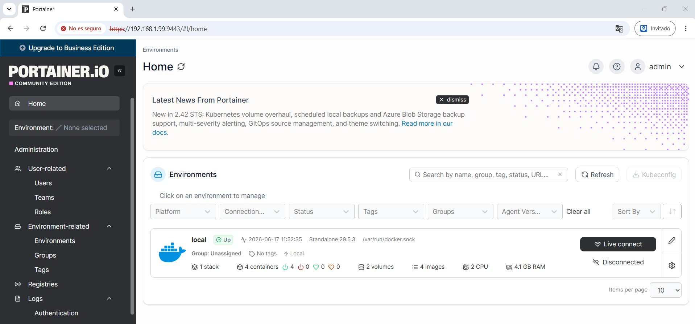

```
https://IP-SRV-DOCKER:9443
```

> Portainer usa HTTPS obligatoriamente en el puerto 9443. El certificado es autofirmado, el navegador mostrará una advertencia que hay que aceptar.

### Portainer — Contenedores

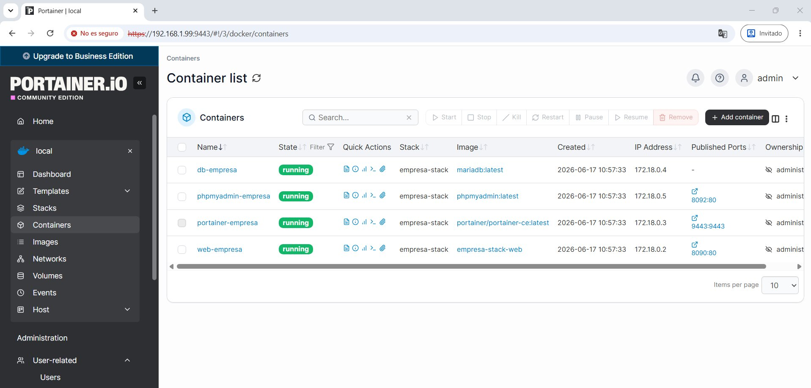

| Contenedor | Estado | Imagen | Puertos |
|---|---|---|---|
| db-empresa | running | mariadb:latest | — |
| phpmyadmin-empresa | running | phpmyadmin:latest | 8092:80 |
| portainer-empresa | running | portainer/portainer-ce:latest | 9443:9443 |
| web-empresa | running | empresa-stack-web | 8090:80 |

### Portainer — Volúmenes

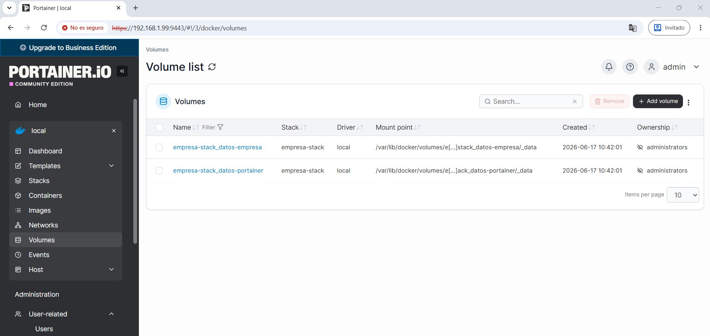

### Portainer — Red y contenedores conectados

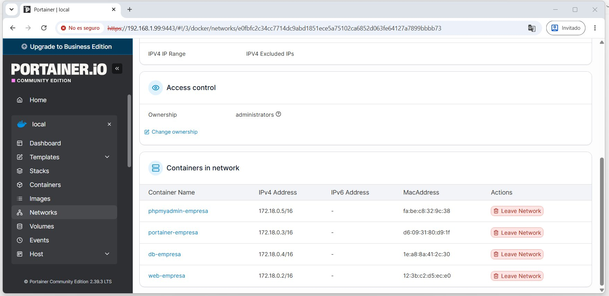

Los 4 contenedores comparten la red `empresa-stack_red-empresa` y se resuelven entre sí por nombre gracias al DNS interno de Docker (por ejemplo, phpMyAdmin se conecta a `db-empresa` sin necesidad de conocer su IP).

---

## Persistencia de datos

Para comprobar que los datos sobreviven al ciclo de vida de los contenedores se realizó la siguiente prueba:

```bash
# 1. Insertar datos en la base de datos vía phpMyAdmin
INSERT INTO prueba_docker (mensaje) VALUES ('Stack funcionando correctamente');

# 2. Derribar todo el stack
docker compose down

# 3. Verificar que no queda nada corriendo
docker ps -a

# 4. Levantar el stack de nuevo
docker compose up -d

# 5. Comprobar que el dato sigue existiendo
SELECT * FROM empresa_multisede.prueba_docker;
```

El registro `'Stack funcionando correctamente'` persiste tras el `down`/`up` completo, porque vive en el volumen `datos-empresa`, no en el contenedor en sí.

---

## Problemas encontrados

**Problema:** `docker build` fallaba con `failed to read dockerfile: open Dockerfile: no such file or directory`.
**Causa:** El comando se ejecutaba desde dentro de la subcarpeta `html/` en lugar de la raíz del proyecto donde está el Dockerfile.
**Solución:** Ejecutar `docker build` siempre desde la carpeta que contiene el Dockerfile, verificando con `ls` antes de construir.

---

**Problema:** `docker compose up -d` fallaba con `Conflict. The container name "/db-empresa" is already in use`.
**Causa:** Contenedores sueltos de ejercicios de práctica anteriores ocupaban los mismos nombres que el stack de Compose.
**Solución:** Limpiar el entorno antes de desplegar el proyecto definitivo con `docker stop $(docker ps -aq)` y `docker rm $(docker ps -aq)`.

---

**Problema:** Error `Bind for 0.0.0.0:8090 failed: port is already allocated`.
**Causa:** Un contenedor de pruebas anterior seguía usando el puerto 8090.
**Solución:** Identificar el contenedor con `docker ps` y eliminarlo antes de levantar el stack.

---

**Problema:** Portainer no cargaba la interfaz web.
**Causa:** Se accedía por `http://` en lugar de `https://`; Portainer exige HTTPS en el puerto 9443.
**Solución:** Acceder con `https://IP-SRV-DOCKER:9443` aceptando la advertencia de certificado autofirmado, y reiniciar el contenedor con `docker restart portainer-empresa` tras un timeout inicial.

---

*Laboratorio realizado con Docker Engine y Docker Compose sobre Ubuntu Server 22.04 LTS — Daniel Moisés Loyo Vásquez*
